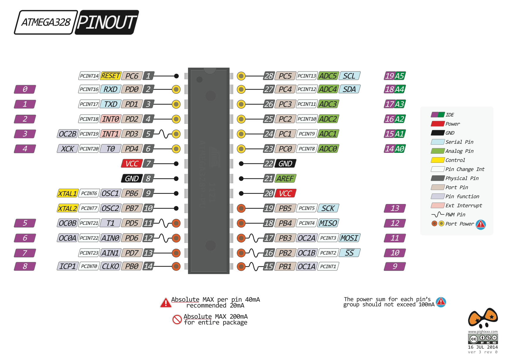
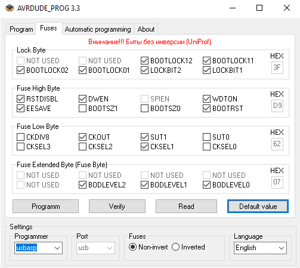

# ATmega328P-PU

[product page](http://www.atmel.com/devices/atmega328p.aspx)

## datasheet

[complete](./datasheet/Atmel-8271-8-bit-AVR-Microcontroller-ATmega48A-48PA-88A-88PA-168A-168PA-328-328P_datasheet_Complete.pdf)  
[summary](Atmel-8271-8-bit-AVR-Microcontroller-ATmega48A-48PA-88A-88PA-168A-168PA-328-328P_datasheet_Summary.pdf)

## pinout

## bootloader

`./arduino ide/hardware` - hardware configuration for standalone atmega328 chip  
[Minimal Circuit (Eliminating the External Clock)](https://www.arduino.cc/en/Tutorial/ArduinoToBreadboard)  
[ATmega328 bootloader Arduino UNO ISP](https://www.youtube.com/watch?v=VIf1WJrF8Hc)

## samples

### ./src/blink

simple blink

## lessons

[Программирование микроконтроллеров](https://www.youtube.com/playlist?list=PLAD2367D3BC9A9638)

## links

[Конфигурация FUSE бит](http://easyelectronics.ru/avr-uchebnyj-kurs-konfiguraciya-fuse-bit.html)  
[Fuse-биты — это не страшно](https://embedderslife.wordpress.com/2012/03/07/fuse-bits-aren-t-scary/)  
[Как правильно прошить AVR фьюзы (fuse bit)](http://www.getchip.net/posts/068-kak-pravilno-proshit-avr-fyuzy-fuse-bit/)  
[Arduino / ATmega 328P fuse settings](http://www.martyncurrey.com/arduino-atmega-328p-fuse-settings/)  
