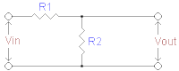

## current version ESP8266 - ESP07

### manufacturer

Ai-Thinker Technology Co. Ltd.

### default firmware version

AT version:0.60.0.0(Jan 29 2016 15:10:17)  
SDK version:1.5.2(7eee54f4)  
Ai-Thinker Technology Co. Ltd.  
May  5 2016 17:30:30

### default speed

debug information during start send on **74880** baud
then module switched to **115200** baud

## 5v -> 3.3V for arduino TX line



Vin  = 5V
R1   = 10 Om
R2   = 20 Om
Vout = 3.3V

## flash firmware

- go to [download documentation](http://espressif.com/en/support/download/documents) page end download the **ESP8266 SDK Getting Started Guide**
- go to [download SDKs & Demos](http://espressif.com/en/support/download/sdks-demos) page end download latest **ESP8266 NONOS SDK**
- at the **Download Addresses** section for **Non-FOTA** SDK described memory addresses for firmware files. Also memory addresses description can be found in readme located in firmware zip `\ESP8266_NONOS_SDK\bin\at\README.md`

### get debug information

- power off
- connect by terminal using **74880** baud rate
- power on
- after module booted you see the following in terminal:  

  ```
  ets Jan  8 2013,rst cause:2, boot mode:(3,6)

  load 0x40100000, len 1856, room 16
  tail 0
  chksum 0x63
  load 0x3ffe8000, len 776, room 8
  tail 0
  chksum 0x02
  load 0x3ffe8310, len 552, room 8
  tail 0
  chksum 0x79
  csum 0x79

  2nd boot version : 1.5
    SPI Speed      : 40MHz
    SPI Mode       : DIO
    SPI Flash Size & Map: 8Mbit(512KB+512KB)
    jump to run user1 @ 1000
  ```
### switch in flashing mode

https://github.com/esp8266/esp8266-wiki/wiki/Boot-Process#esp-boot-modes

- power off
- connect GPIO0 => GND
- connect GPIO2 => VCC
- connect GPI15 => GND
- power on

try to push **start** button in the **ESP Flash Download Tool** to fill the "DETECTED INFO" area

### ESP Flash Download Tool

- run tool
- push **start** button
- set **CrystalFreq** and **FLASH SIZE** regarding information you receive in "DETECTED INFO" area:

  flash vendor:  
  E0h : N/A  
  flash devID:  
  4014h  
  QUAD;**8Mbit**  
  crystal:  
  **26 Mhz**  

- select firmware files and corresponding addresses using readme located at `\ESP8266_NONOS_SDK\bin\at\README.md` or **SDK Getting Started Guide** f.e:

  ```
  \ESP8266_NONOS_SDK\bin\esp_init_data_default.bin     @ 0xFC000
  \ESP8266_NONOS_SDK\bin\blank.bin                     @ 0xFE000
  \ESP8266_NONOS_SDK\bin\at\noboot\eagle.flash.bin     @ 0x00000
  \ESP8266_NONOS_SDK\bin\at\noboot\eagle.irom0text.bin @ 0x10000
  \ESP8266_NONOS_SDK\bin\blank.bin                     @ 0x7e000
  ```
- push **start** button
- after firmware flashed

  - power off  
  - disconnect GPIO0 from GND  
  - power on  

## commands

### general

**AT+GMR** - get current firmware version

### wifi [station]

`AT+CWMODE=1`               - switch to station mode  
`AT+CIPSTAMAC?`             - get current module MAC  
`AT+CWLAP`                  - list available access points  
`AT+CWJAP="AP name","pass"` - connect to access point  
`AT+CIPSTA?`                - get current module IP  
`AT+PING="ya.ru"`           - ping host  
`AT+UART_DEF=9600,8,1,0,0`  - set connection baud rate to 9600 (databits: 8,stopbits: 1,parity: none,flow control: disable flow control)  

## software

### ESPlorer

http://esp8266.ru/esplorer/

## links

[wikipedia](https://en.wikipedia.org/wiki/ESP8266)  
[docs](http://www.espressif.com/en/support/download/documents)  
[esp8266-wiki](https://github.com/esp8266/esp8266-wiki)  
[Firmware Builder](https://wifi-iot.com/)  
[Программируем ESP8266 в Arduino IDE](http://samopal.pro/esp8266-4/)  
[ESP8266 ES07](http://samopal.pro/esp8266-3/)  
[Статьи и документация по ESP8266 с резюме (подключение, прошивка, старт, SDK, AT, Arduino, Lua)](http://esp8266.ru/forum/threads/stati-i-dokumentacija-po-esp8266-s-rezjume-podkljuchenie-proshivka-start-sdk-at-arduino-lua.157/)  
[Распиновка ESP8266, различные модификации модулей на базе ESP8266](http://esp8266.ru/modules-esp8266/#more-35)  
[ESPlorer — IDE для ESP8266](http://esp8266.ru/esplorer-ide-esp8266/)  
[ESP8266 Community Forum](http://www.esp8266.com/)  
[ESP8266 Community Forum repo](https://github.com/esp8266)  
[Что внутри «народного wi-fi»?](https://habrahabr.ru/company/coolrf/blog/238443/)  
[Reverse Engineering ESP8266 — часть 1 ](https://habrahabr.ru/post/255135/)  
[Reverse Engineering ESP8266 — часть 2 ](https://habrahabr.ru/post/255153/)  
[Контроль качества воздуха (со2 и температуры) в офисе и дома, своими руками](https://habrahabr.ru/post/301296/)  
[ESP8266 Часть 1. Вводная](https://www.youtube.com/watch?v=WrTm5QlWnaE)  
https://github.com/espressif/ESP8266_AT/wiki  
https://blogs.msdn.microsoft.com/abhinaba/2016/01/23/esp8266-wifi-with-arduino-uno-and-nano/  
http://lantaukwcounter.blogspot.com/2015/02/getting-esp8266-wifi-module-to-work.html  
http://ruben1.narod.ru/hobby/arduino/wifi_nano.html  
http://makercorner.blogspot.pt/2016/06/esp8266-firmware-update-flash-update.html  
[voltage devider calculator](http://www.raltron.com/cust/tools/voltage_divider.asp)  