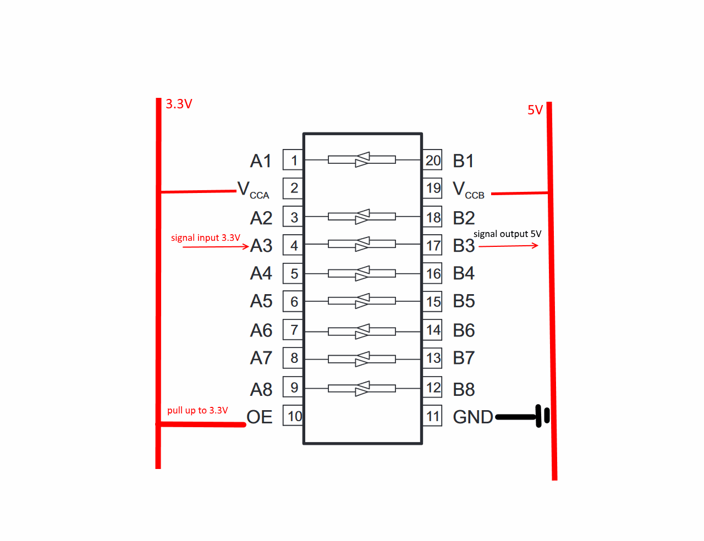

# TXB0108

TXB0108 8-Bit Bidirectional Voltage-Level Translator with Auto-Direction Sensing

in case when pin not used - it should be pulled down to ground. without grounding not used pins it will behave strange
