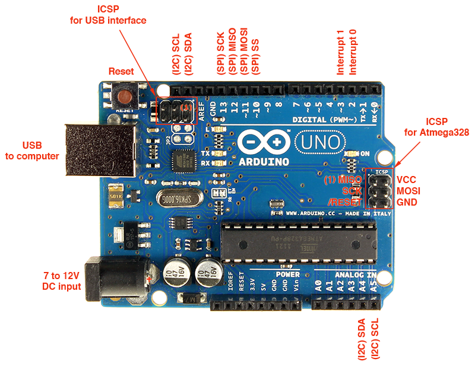

# programmers

## USBasp

> USBasp is a USB in-circuit programmer for Atmel AVR controllers. It simply consists of an ATMega88 or an ATMega8 and a couple of passive components. The programmer uses a firmware-only USB driver, no special USB controller is needed.

[HOME PAGE](http://www.fischl.de/usbasp/)

To allow **USBasp** programmer work with **Arduino UNO** you will need the **ISP 10P to ICSP 6P** adapter

Or use **Dupont cables** to connect Arduino ISP 6 PIN to USBasp 10 PIN

If yo use Arduino IDE:

- Tools->Boards->Your Board
- Tools->Programmer->USBasp
- Sketch->Upload Using a Programmer

to rollback bootloader:

- Tools->Boards->Your Board
- Tools->Programmer->USBasp
- Tools->Burn Bootloader

### soft

[AVRDUDE](savannah.nongnu.org/projects/avrdude/)  
[AVRDUDE_PROG](http://www.yourdevice.net/proekty/avrdude-prog)  
[DRIVER](http://zadig.akeo.ie/)  

### articles

[Работаем с arduino через usbasp](http://www.elenblog.ru/rabotaem-s-arduino-cherez-usbasp/)  
[Программатор AVR за 3$ (USBasp)](www.elenblog.ru/programmator-avr-za-3-usbasp)  
[Прошивка микроконтроллеров Atmega без arduino через USBasp](http://homes-smart.ru/index.php/oborudovanie/arduino/proshivka-mikrokontrollerov-atmega-cherez-usbasp)  
[Arduino Uno Rev3 pinouts](http://www.gammon.com.au/uno)  
[Перепрошивка bootloader](https://it4it.club/topic/19-pereproshivka-bootloader-zagruzchika/)  
[Обновление прошивки USBASP для AVR](https://www.youtube.com/watch?v=DoloyE_pGfY)  

### where to buy

[USBasp](http://www.aliexpress.com/item/USB-ISP-USBASP-Programmer-for-ATMEL-51-AVR-Programmer/32347555433.html)  

[ISP 10P to ICSP 6P adapter](http://www.aliexpress.com/item/Avrisp-usbasp-stk500-10pin-to-6pin-Adapter-Board-free-shipping/32249891688.html)
