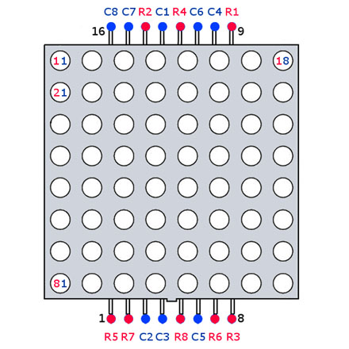
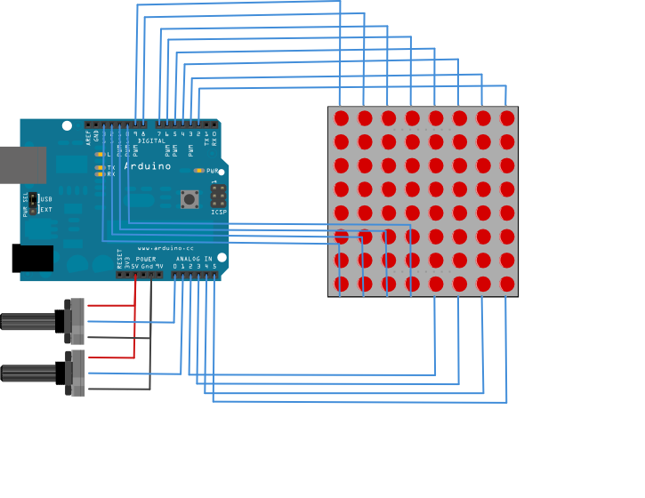

## led Matrix

pins count goes from the lower left corner of the counter-clockwise direction, if you hold the matrix of the front side facing you.

The bottom is where the protrusion on the edge. In the same bottom age the serial number is printed.

## scheme

## matrix of the pin connections

| Matrix pin no. | Row | Column | Arduino pin number |
| -------------  | --- | ------ | ------------------ |
|        1       |  5  |        |          13        |
|        2       |  7  |        |          12        |
|        3       |     |   2    |          11        |
|        4       |     |   3    |          10        |
|        5       |  8  |        | 16 (analog pin 2)  |
|        6       |     |   5    | 17 (analog pin 3)  |
|        7       |  6  |        | 18 (analog pin 4)  |
|        8       |  3  |        | 19 (analog pin 5)  |
|        9       |  1  |        |           2        |
|        10      |     |   4    |           3        |
|        11      |     |   6    |           4        |
|        12      |  4  |        |           5        |
|        13      |     |   1    |           6        |
|        14      |  2  |        |           7        |
|        15      |     |   7    |           8        |
|        16      |     |   8    |           9        |

## sketches

### led_matrix_with_potentiometers

set direction of the pixel on matrix using potentiometers

### led_matrix_multiplexing

print patterns on the matrix using multiplexing

### led_matrix_scrolling_text

scroll text from right to left. require [FrequencyTimer2](http://playground.arduino.cc/Code/FrequencyTimer2) library

## links

https://www.arduino.cc/en/Tutorial/RowColumnScanning  
http://www.appelsiini.net/2011/how-does-led-matrix-work  
http://jewelfox.ru/lot.php?id=1078  
http://www.ledtoplite.com/uploadfile/2014/0807/20140807034706449.pdf  
http://kofler.dot.at/c64/index.html  
http://int10h.org/oldschool-pc-fonts/readme/
