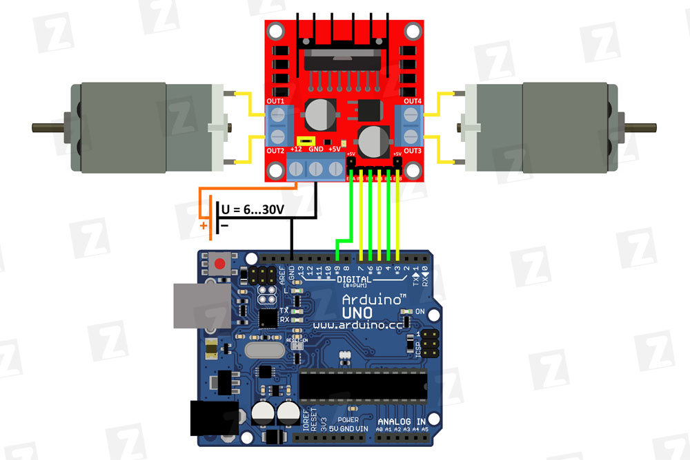

# motor drivers

## L298N

### links

http://zelectro.cc/Motor_shield_L298N_Arduino

## HG7881 (L9110)

### links

https://www.bananarobotics.com/shop/How-to-use-the-HG7881-(L9110)-Dual-Channel-Motor-Driver-Module  
https://github.com/tangrs/HG7881-Arduino/blob/master/HG7881.cpp
