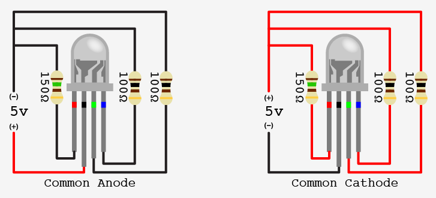

# RGB LED

there was two types of RGB LEDs - with common anode (+) and with common cathode (-)

## samples

### ./src/sparkfun-test

show basic functionality. before uploading to arduino - choose which type of RGB you connected
