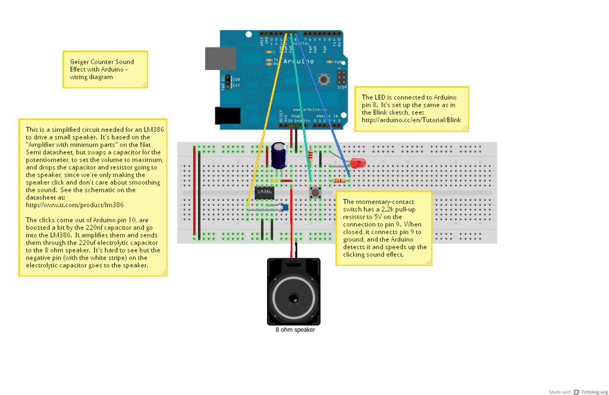

# fake geiger counter

simulate geiger counter sound. in case of button pushed - clicks sounds increased

## schematics

## deteils list

- LM386 Low Voltage Audio Power Amplifier
- 220nf (nanofarad) capacitor
- 220uf (microfarad) electrolytic capacitor
- 8 ohm speaker
- Pushbutton, momentary on
- 2.2k resistor
- 330 ohm resistor
- LED
- PAM8403 Digital Amplifier Board
- On/off switch

## links

http://www.instructables.com/id/How-To-Make-A-Fake-Geiger-Counter/
